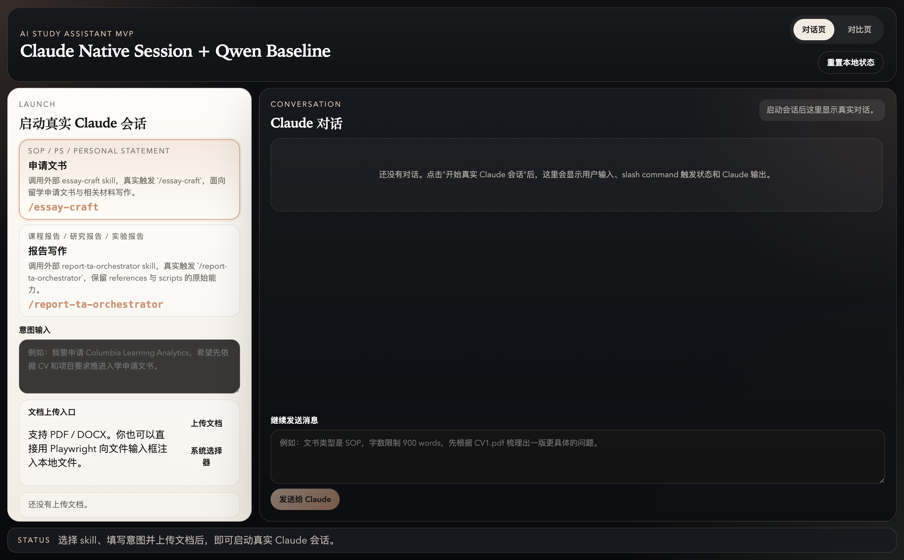
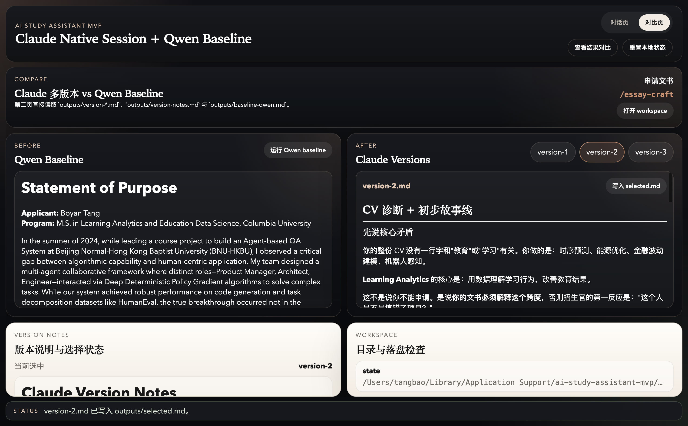
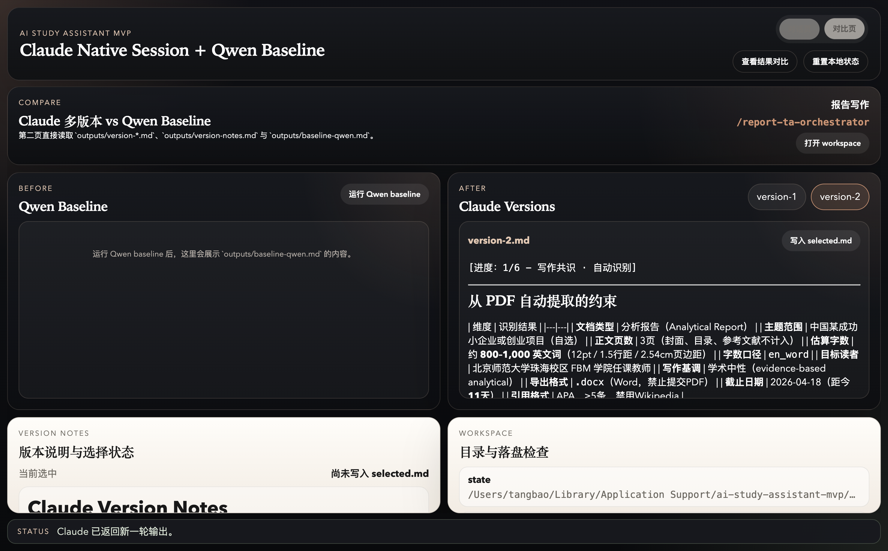

# PaperReportDemo

AI Study Assistant MVP 的源码仓库，包含 Electron 桌面应用和两套 Claude skills。

## Overview

这个项目当前聚焦两个核心工作流：

- 申请文书：通过 `/essay-craft` 驱动真实 Claude 会话，结合本地 PDF / DOCX 推进入学文书写作
- 报告写作：通过 `/report-ta-orchestrator` 驱动真实 Claude 会话，围绕课程报告或论文进行分步写作

同时保留了：

- Qwen baseline 作为对照组
- Claude 多轮输出版本对比页
- 本地工作区、状态文件与产出文件落盘
- 打包后可直接运行的 macOS Apple Silicon 与 Windows x64 版本

## Screenshots

### 启动页



### 文书对比页



### 报告对比页



## Repo Layout

- `ai-study-assistant-mvp/`: Electron 桌面应用源码
- `skills/essay-craft/`: 文书写作 skill
- `skills/report-ta-orchestrator/`: 报告写作 skill

## Local Development

```bash
cd ai-study-assistant-mvp
npm install
npm run dev
```

## Build And Smoke

```bash
cd ai-study-assistant-mvp
npm run dist:mac
npm run smoke:packaged
```

当前 smoke 会实际使用仓库中的：

- `CV1.pdf`
- `report1.pdf`

## Release Assets

发布后的桌面资产统一使用下面的命名规则：

- `AI-Study-Assistant-MVP-v<version>-mac-m-chip-<YYYY-MM-DD>.zip`
- `AI-Study-Assistant-MVP-v<version>-win-x64-<YYYY-MM-DD>.zip`

对应的 SHA256 文件会和资产一起发布。

最新可下载版本见：

- [GitHub Releases](https://github.com/Tt200411/PaperReportDemo/releases)

## Notes

- `火种/` 不纳入这个仓库
- `node_modules/`、`out/`、`dist/` 等生成目录不提交
- 当前 mac 产物为 ad-hoc 签名，首次运行可能需要手动放行
